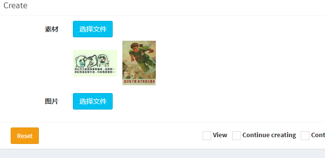

File-browser
======
a simple file browser extension for laravel-admin

一个简单的文件浏览扩展

本扩展包是基于[media-manager](https://github.com/laravel-admin-extensions/media-manager)的一个目录文件查看工具，可以直接用于Form表单。
版本为laravel-admin 1.6

1,安装:
````
composer require laravel-admin-ext/file-browser
````

2,发布media-manager的文件(如已发布，可跳过)
````
php artisan admin:import media-manager
````

3,配置`config/admin.php`文件的(本扩展共用media-manager的配置)
````
    'extensions' => [

        'media-manager' => [
        
            // Select a local disk that you configured in `config/filesystem.php`
            'disk' => 'public'
        ],
    ],

````

4,注册进laravel-admin,在app/Admin/bootstrap.php中添加以下代码：
````
Encore\Admin\Form::extend('media', \Encore\FileBrowser\FileBrowserField::class);
````

5,直接调用就可以了,path选项可以指定目录,否则将使用默认根目录。
````
$form->media('ColumnName', 'LabelName')->path('uploads');

$form->media('ColumnName', 'LabelName')->path('uploads/images');
````
注意：
---
1，本扩展不支持识别目录(即文件夹)，仅识别path设定的一级目录下的所有文件；
2，本扩展默认可多选，字段存为json字符串，模型文件需添加如下修改器：
```
 public function getImagesAttribute($v)
    {
        return json_decode($v, true);
    }
```
效果如图：

默认：

选择：

选中：